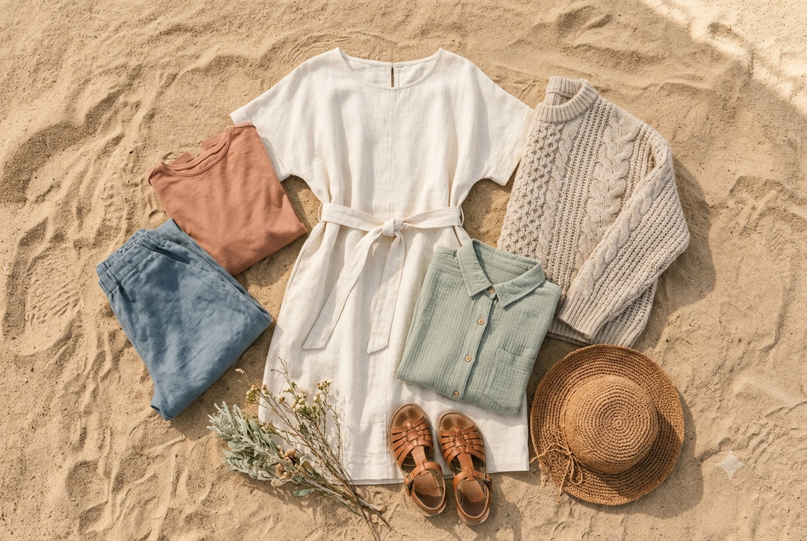
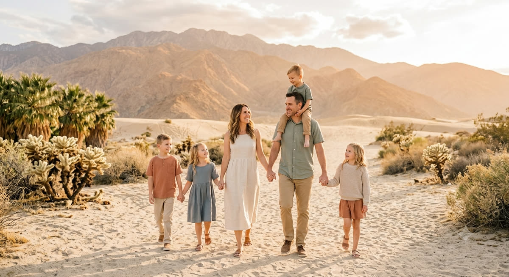
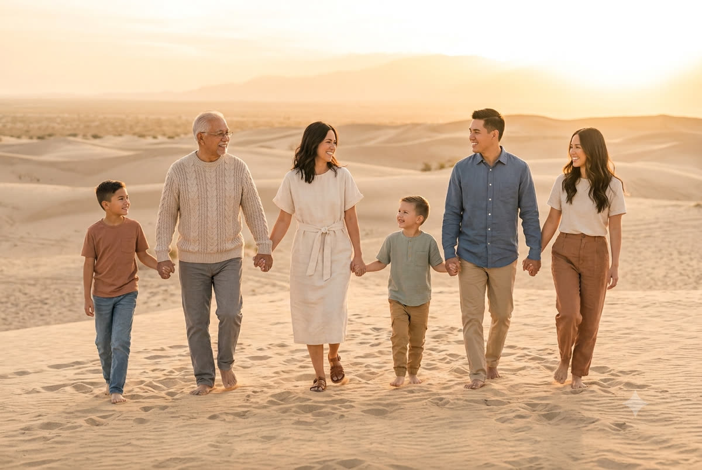
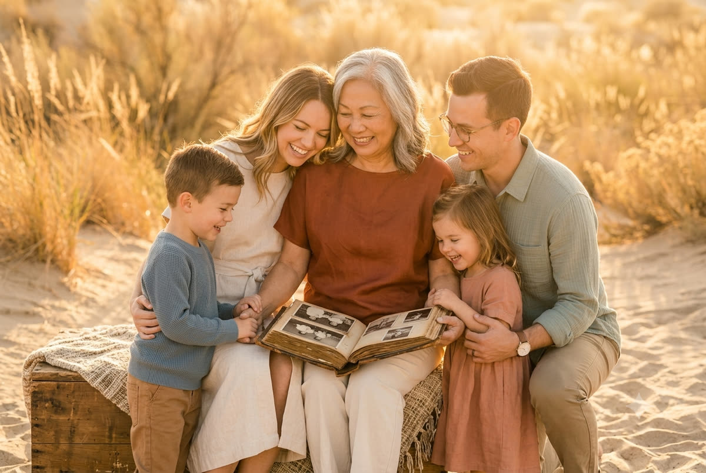
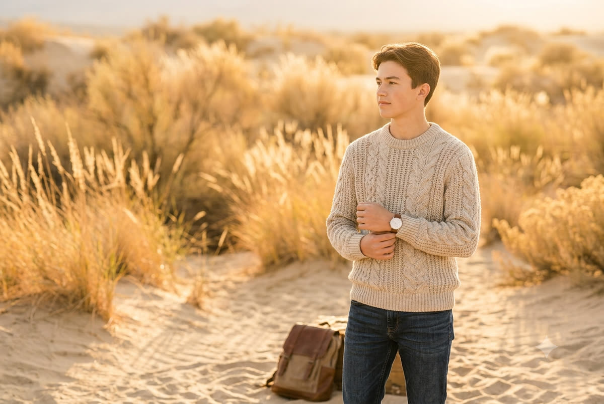

# mgp-blog-images

Category images for the **Margot Gibson Photography** blog — one image per content
category, embedded in posts at import (the `mgp-blog` WXR pipeline references these
raw URLs). Replace any file with Margot's real photo (keep the same name) and the
blog picks it up automatically.

<table>
<tr>
<td align="center" width="33%"> <b>What to Wear</b></td>
<td align="center" width="33%"> <b>Desert Family Photography</b></td>
<td align="center" width="33%"> <b>Headshots &amp; Personal Branding</b></td>
</tr>
<tr>
<td align="center"> <b>Seasonal &amp; Location Guides</b></td>
<td align="center"> <b>Multigenerational &amp; Extended Family</b></td>
<td align="center"> <b>Golden Hour &amp; Desert Light</b></td>
</tr>
<tr>
<td align="center"> <b>Legacy &amp; Heritage</b></td>
<td align="center"> <b>Senior Portraits</b></td>
<td align="center"> <b>Children &amp; Milestone Sessions</b></td>
</tr>
<tr>
<td align="center"> <b>In-Home &amp; Lifestyle</b></td>
<td></td><td></td>
</tr>
</table>
